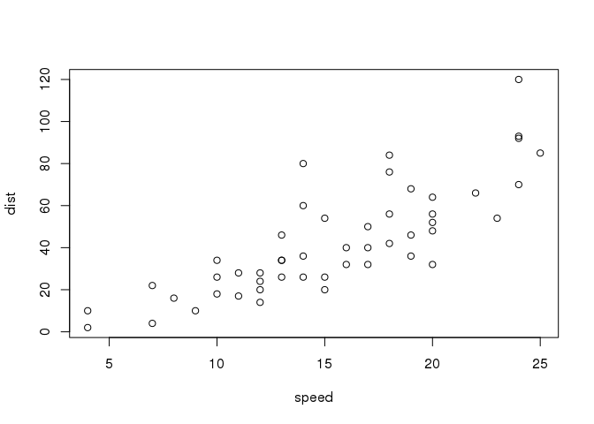
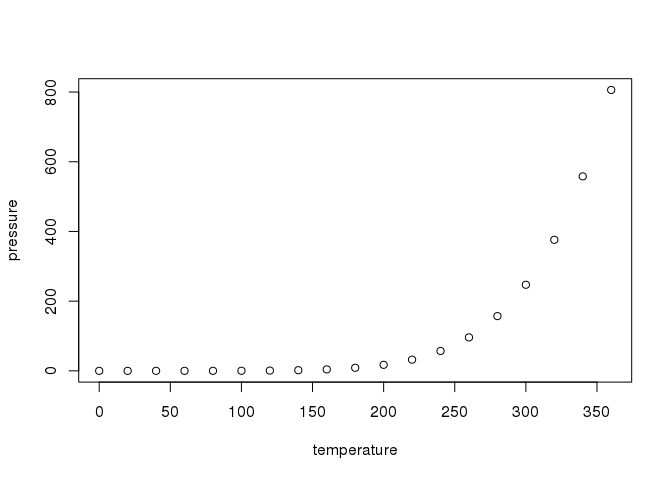

마크다운
================
hunmin.kang

<!-- 위에 3줄은 변경이 불가능하다. output이 템플릿이다.  -->
<!-- 위에 3줄은 변경이 불가능하다. author는 삭제 가능하다.  -->
<!-- output: html_document, output: pdf_document, output: word_document 도 사용할 수 있다.-->
<!-- 피겨의 높이는 7*5가 기본이다. -->
<!-- html_document일 때 toc가 true이면 왼쪽에 플롯팅 표가 생기게 된다.  -->
<!-- http://rmarkdown.rstudio.com/html_document_format.html#overview -->
<!-- 아웃풋별로 문법이 표시되는 방법이 조금씩 다르다. 본 화면은 깃허브 기준이다. -->
기본 구문
---------

편집기 상에서 아래 코드 청크에 *Ctrl+Shift+Enter*를 누르면 편집기 상에서 쥬피터처럼 표시된다.

``` r
plot(cars)
```



``` r
summary(cars)
```

    ##      speed           dist       
    ##  Min.   : 4.0   Min.   :  2.00  
    ##  1st Qu.:12.0   1st Qu.: 26.00  
    ##  Median :15.0   Median : 36.00  
    ##  Mean   :15.4   Mean   : 42.98  
    ##  3rd Qu.:19.0   3rd Qu.: 56.00  
    ##  Max.   :25.0   Max.   :120.00

새로운 코드 청크를 만들려면 *Ctrl+Alt+I*를 누른다.

html파일로 만들기 위해서는 *Ctrl+Shift+K* 를 누른다. knit는 코드 청크를 실행하지만, preview는 코드 청크를 실행하지 않는 차이가 있다.

R-Studio의 기본단축키 alt+l 등으로 모든 구문을 펼치고 닫을 수 있다.

입력 구문
---------

위에서 처럼 \#\# 을 입력하면 제목 2로 처리된다. 제목1은 타이틀과 같기 때문에 잘 사용하지 않는다.
새로운 달락을 시작하려면 줄 마지막을 공백 2개로 끝낸다.
지금 이 문장 위에 문장에 공백 두개가 끝에 있다. 종종 Rsutdio에서 자동으로 만든다.
제목은 \#\#\#\#\#\# 6까지 지원된다.

\*을 3개 이상 사용하면 수평선 처리 된다.

------------------------------------------------------------------------

기울인 글씨는 *기울기* 를 사용하면 된다. 굵은 글씨는 **굵은** 을 사용하면 된다.
취소선은 ~~취소선~~ 을 사용하면 된다.
윗첨자는 ^과 ^사이에 글자를 넣어 만든다. <sup>2</sup>
하이퍼링크는 \[link\]로 적은 뒤 ()에 주소를 적으면 된다. [link](nahz.com)
inline equation: *A* = *π* \* *r*<sup>2</sup> 은 $기호 사이에 작성하면 되나, 모든 notaion이 구현되는 것은 아니다.
이미지는 image:라고 쓰고 \[\] 을쓰고 이어서 ()안에 상대경로를 쓰면 된다. \[\](mark01\_files/figure-markdown\_github-ascii\_identifiers/pressure-1.png

> 화살표를 사용하면 인용표시 효과가 나타난다.

-   별 기호를 쓰면 서브아이템 표시를 할 수 있다.
-   더하기 기호를 쓰면 서브파이템 표시를 할 수 있다.
-   앞에 띄어쓰기를 넣어도 적용되지 않는다.

표는 다음과 같이 구현한다.
다음의 사이트에서 쉽게 만들 수 있다. (복사 붙여 넣기 됨)
<https://www.tablesgenerator.com/markdown_tables>

| Table Header | Second Header |
|--------------|---------------|
| Table Cell   | Cell 2        |
| Cell 3       | Cell 4        |

위의 표를 붙여 넣을 때는 되도록 들여쓰기를 해야 한다. 들여쓰기를 안하면 접기할 때 표가 나타난다.

표를 쓸 때 R에 있는 데이터는 kable을 통해 처리하는 게 보기 좋다.

|  Sepal.Length|  Sepal.Width|  Petal.Length|  Petal.Width| Species |
|-------------:|------------:|-------------:|------------:|:--------|
|           5.1|          3.5|           1.4|          0.2| setosa  |
|           4.9|          3.0|           1.4|          0.2| setosa  |
|           4.7|          3.2|           1.3|          0.2| setosa  |
|           4.6|          3.1|           1.5|          0.2| setosa  |
|           5.0|          3.6|           1.4|          0.2| setosa  |

응용 구문
---------

-   모든 코드는 틸트r 이라고 쓴 뒤 틸트로 닫으면 r명령어로 동작한다. 명령어는 출력되지 않고 명령어 결과만 리턴된다.(대문자가 아님!)
    &gt;4

-   틸트를 3개 쓴 뒤 {r}이라고 쓰면 R코드를 쓸 수 있는 공간으로 동작하며, 코드와 식이 모두 나타난다.

``` r
dim(iris)
```

    ## [1] 150   5

-   틸트를 3개 쓴 뒤 {r eval=FALSE}라고 쓰면 코드는 실행되지 않고 구문만 나타난다.

``` r
dim(iris)
```

-   echo=FALSE라고 사용하면 반대로 코드는 나타나지 않고 결과만 출력된다.
    

-   echo, message, warning을 모두 false로 처리하면 보이지 않게 처리된다.

-   청크에 r 하고 띄어쓴 뒤 "나 , 없이 바로 네임을 적으면 그것이 청크의 이름이 된다.

``` r
dim(iris)
```

    ## [1] 150   5

깃허브와 연동하는 방법
----------------------

<http://nickstrayer.me/RMarkdown_Sites_tutorial/>
<https://git-scm.com/book/ko/v1/%EC%8B%9C%EC%9E%91%ED%95%98%EA%B8%B0>
<https://rogerdudler.github.io/git-guide/index.ko.html>
<https://nolboo.kim/blog/2013/10/06/github-for-beginner/> <https://www.slideshare.net/ibare/dvcs-git>
